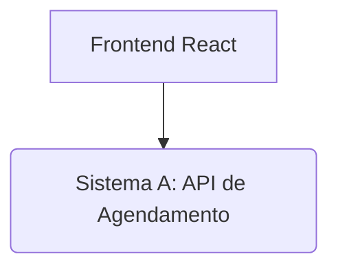

# Técnicas de Integração de Sistemas - Dog Walker

## Objetivo do Projeto

Este projeto acadêmico tem como objetivo demonstrar a integração de sistemas através do desenvolvimento de um aplicativo para agendamento e contratação de serviços de passeios com cachorros. A solução é composta por um sistema principal (API de agendamento), um serviço de pagamento interno fictício e uma interface de usuário em React, utilizando Node.js, Express e Jest.

## Descrição Funcional da Solução

O **Dog Walker App** permite que usuários agendem passeios para seus cachorros. O processo envolve:

1.  **Registro e Login:** Usuários podem se registrar e fazer login para acessar as funcionalidades do aplicativo.
2.  **Visualização de Passeadores:** Usuários podem visualizar uma lista de passeadores disponíveis, com informações como nome, preço e avaliação.
3.  **Agendamento de Passeios:** O usuário preenche um formulário no frontend com informações como ID do usuário, ID do passeador e valor do serviço para agendar um passeio.
4.  **Processamento de Pagamento:** Ao submeter o agendamento, o Sistema A utiliza seu **Serviço de Pagamento Interno** para simular a aprovação da transação.
5.  **Confirmação:** O status do pagamento (sempre "paid" para este projeto) é registrado junto ao agendamento.
6.  **Consulta de Agendamentos:** O usuário pode consultar os detalhes de agendamentos existentes.

## Arquitetura da API

A arquitetura do sistema é modular, dividida em dois componentes principais:

*   **Frontend (React):** A interface do usuário, responsável por interagir com o usuário e enviar requisições para o Sistema A.
*   **Sistema A (API de Agendamento - Node.js/Express):** O backend principal que gerencia a lógica de negócios para usuários, passeadores e agendamentos de passeios. Ele também incorpora um **Serviço de Pagamento Interno** que simula o processamento de pagamentos. Para este projeto acadêmico, os dados são armazenados em memória volátil, o que significa que serão perdidos ao reiniciar o servidor.



## Instruções para Rodar o Backend e Frontend

### Pré-requisitos

*   Node.js (versão 14 ou superior)
*   npm ou yarn

### Configuração e Execução

1.  **Clone o repositório:**

    ```bash
    git clone <URL_DO_REPOSITORIO>
    cd tecnicas-de-intregracao/tecnicas-de-intregracao
    ```

2.  **Backend (Sistema A):**

    ```bash
    cd src/backend
    npm install
    npm start
    ```

    A API estará rodando em `http://localhost:3001` (ou outra porta configurada).

3.  **Frontend (React):**

    ```bash
    cd src/frontend
    npm install
    npm run dev
    ```

    A aplicação React será aberta no seu navegador em `http://localhost:5173` (ou outra porta configurada).

## Instruções para Testar no Postman/Insomnia

Uma coleção do Postman/Insomnia será fornecida na pasta `docs/postman-collection.json` com exemplos de requisições para os endpoints do Sistema A. Importe esta coleção no seu cliente preferido e execute os testes.

### Passos para Testar:

1.  **Inicie o Backend:** Certifique-se de que o Sistema A (backend) esteja rodando conforme as instruções acima.
2.  **Importe a Coleção:** No Postman ou Insomnia, importe o arquivo `docs/postman-collection.json`.
3.  **Execute as Requisições:**
    *   **User Registration:** Crie um novo usuário (ex: `novo.usuario@example.com`).
    *   **User Login:** Faça login com o usuário criado para simular a autenticação.
    *   **List Walkers:** Obtenha a lista de passeadores disponíveis.
    *   **Schedule Walk:** Agende um passeio usando o `userId` do usuário registrado e um `walkerId` da lista de passeadores.

## Documentação das Rotas

A documentação detalhada das rotas da API (Sistema A) pode ser encontrada em `docs/api-routes.md`.

## Relação com ODS 11 (Cidades e Comunidades Sustentáveis)

O projeto **Dog Walker App** contribui indiretamente para o Objetivo de Desenvolvimento Sustentável (ODS) 11: "Tornar as cidades e os assentamentos humanos inclusivos, seguros, resilientes e sustentáveis". Embora não seja uma solução direta para grandes desafios urbanos, ele se alinha com a ideia de **melhorar a qualidade de vida em comunidades urbanas** de várias maneiras:

*   **Promoção do Bem-Estar Animal:** Ao facilitar o agendamento de passeios, o aplicativo incentiva a atividade física e o bem-estar dos animais de estimação, o que é um componente importante de comunidades saudáveis e responsáveis.
*   **Geração de Renda Local:** O serviço de "dog walker" pode ser uma fonte de renda para indivíduos na comunidade, contribuindo para a economia local e a inclusão social.
*   **Otimização de Tempo e Recursos:** Para donos de animais com rotinas agitadas, o aplicativo oferece uma solução prática, otimizando seu tempo e permitindo que os animais recebam a atenção necessária, o que pode reduzir o estresse e melhorar a convivência em espaços urbanos.
*   **Uso Eficiente de Espaços Públicos:** Ao organizar e profissionalizar o serviço de passeios, pode-se promover um uso mais consciente e organizado de parques e áreas verdes, contribuindo para a manutenção e o respeito a esses espaços públicos essenciais para a sustentabilidade urbana.

Em suma, ao apoiar o cuidado animal e a economia de serviços locais, o **Dog Walker App** reflete um micro-esforço que se alinha com os princípios de construção de comunidades mais agradáveis, funcionais e sustentáveis para todos os seus habitantes, incluindo os animais de estimação.

