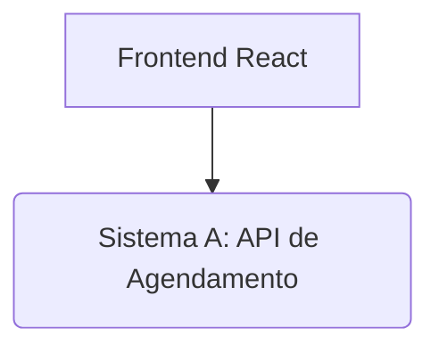

# Arquitetura do DogWalk App

## 1. Visão Geral

O **DogWalk App** é uma solução de integração de sistemas desenvolvida para gerenciar agendamentos de passeios com cachorros. A arquitetura é modular, facilitando a manutenção e a escalabilidade, e é composta por um frontend interativo, um backend principal (API de Agendamento), um microsserviço de pagamento e um banco de dados.

## 2. Componentes da Arquitetura

### 2.1. Frontend (React)

*   **Tecnologia:** Desenvolvido em React, oferece uma interface de usuário dinâmica e responsiva.
*   **Funcionalidade:** Permite aos usuários registrar-se, fazer login, visualizar passeadores disponíveis, agendar passeios e consultar o status de seus agendamentos.
*   **Comunicação:** Interage com o **Sistema A (API de Agendamento)** através de requisições HTTP (RESTful).

### 2.2. Sistema A: API de Agendamento (Backend Principal)

*   **Tecnologia:** Construído com Node.js e o framework Express.
*   **Funcionalidade:** Atua como o cérebro da aplicação, gerenciando a lógica de negócios para usuários, passeadores e agendamentos de passeios. Ele também incorpora um **Serviço de Pagamento Interno** que simula o processamento de pagamentos. Para este projeto acadêmico, os dados são armazenados em memória.
*   **Endpoints Principais:**
    *   `POST /users/register`: Registro de novos usuários.
    *   `POST /users/login`: Autenticação de usuários.
    *   `GET /walkers`: Lista de passeadores disponíveis.
    *   `POST /walks/schedule`: Agendamento de um novo passeio, que invoca o serviço de pagamento interno.

## 3. Fluxo de Interação

1.  O **Frontend** envia requisições para o **Sistema A** (API de Agendamento) para operações como registro, login, listagem de passeadores e agendamento de passeios.
2.  Quando um usuário agenda um passeio (`POST /walks/schedule`), o **Sistema A** valida os dados e, em seguida, invoca seu **Serviço de Pagamento Interno**.
3.  O **Serviço de Pagamento Interno** processa a simulação de pagamento e retorna o status ("paid") para o **Sistema A**.
4.  O **Sistema A** registra o passeio no **Banco de Dados SQLite**, incluindo o status do pagamento, e retorna a confirmação para o **Frontend**.
5.  O **Frontend** exibe o resultado da operação ao usuário.

## 4. Diagrama de Arquitetura

## 5. Considerações de Segurança e Tratamento de Erros

*   **Autenticação/Autorização:** O Sistema A implementa rotas de registro e login (simuladas).
*   **Validação de Entrada:** As APIs realizam validação básica dos dados de entrada para garantir a integridade e prevenir erros.
*   **Tratamento de Erros:** As APIs retornam mensagens de erro claras e códigos de status HTTP apropriados para facilitar a depuração e o feedback ao usuário.

## 6. Testes

*   **Testes Unitários:** O projeto inclui testes unitários para os principais componentes do backend, garantindo a funcionalidade individual.

